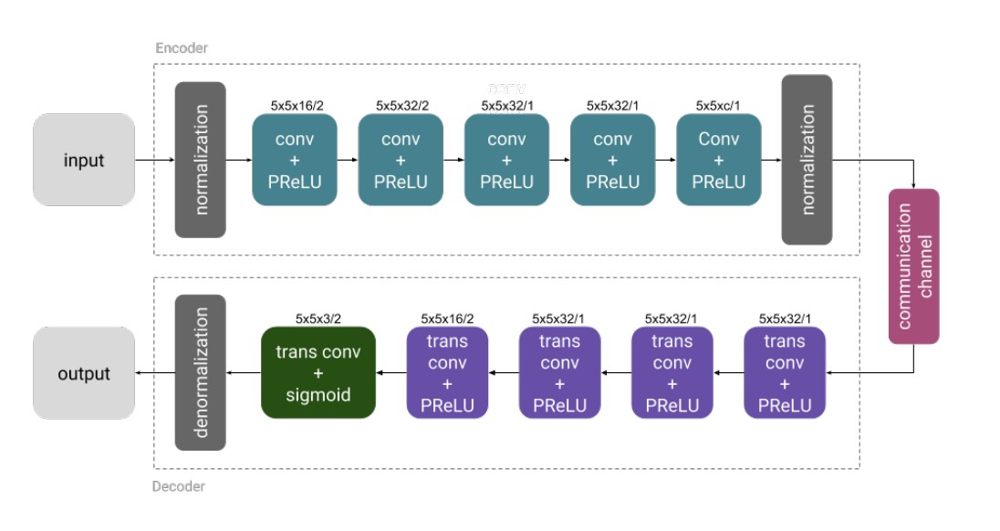
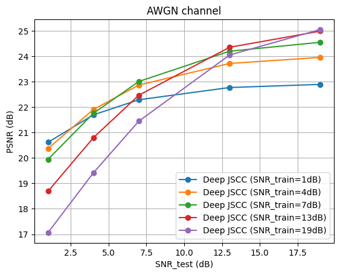

# Deep JSCC — Tutorial Demo

A minimal PyTorch implementation of **Deep Joint Source-Channel Coding (DeepJSCC)** for
wireless image transmission on CIFAR-10. Based on
[Bourtsoulatze et al., 2019](https://ieeexplore.ieee.org/abstract/document/8723589).

[](https://colab.research.google.com/github/samerlahoud/deep-jscc-demo/blob/main/notebooks/demo.ipynb)

## Architecture


Encoder downsamples 32×32×3 to an 8×8×`latent_ch` latent (`latent_ch=8` ⇒ bandwidth
ratio **k/n = 1/6**). The latent is power-normalized, transmitted through a noisy
channel (AWGN or Rayleigh), and decoded back to an image. The whole pipeline is trained
end-to-end with MSE.

## Install
```bash
pip install -r requirements.txt
```

## Quick demo (≈ 1 minute on CPU)
For a live tutorial demo — trains one model on a small CIFAR-10 subset, then evaluates:
```bash
python train.py --quick
python eval.py
```

## Full reproduction
Train one model per `SNR_train ∈ {1, 4, 7, 13, 19}` dB and sweep the test SNR:
```bash
python train.py                 # AWGN, 5 epochs per SNR (default)
python eval.py                  # PSNR + SSIM curves + reconstruction grid
```

## Useful variants
```bash
# Train a single model robust over a range of SNRs (sampled per batch):
python train.py --snr_train_range 0 20

# Train and evaluate over a Rayleigh-fading channel instead of AWGN:
python train.py --channel rayleigh
python eval.py  --channel rayleigh
```

## Outputs
- `checkpoints/deepjscc_<channel>_snrtrain_<tag>.pth` — one per training config.
- `results/<channel>_psnr_ssim_curves.png` — PSNR & SSIM vs. `SNR_test`.
- `results/<channel>_reconstructions.png` — qualitative grid showing each test SNR.

## Reference result (AWGN)


## Files
| File         | Role                                                            |
|--------------|-----------------------------------------------------------------|
| `models.py`  | Encoder / Decoder / `DeepJSCC` wrapper                          |
| `channel.py` | AWGN + Rayleigh channel; `power_normalize`                      |
| `metrics.py` | PSNR + SSIM (pure-torch, no extra deps)                         |
| `utils.py`   | Seeding + reconstruction-grid visualization                     |
| `train.py`   | Training script with CLI args, tqdm, `--quick`, robust-SNR mode |
| `eval.py`    | SNR sweep, curves figure, qualitative reconstructions           |
